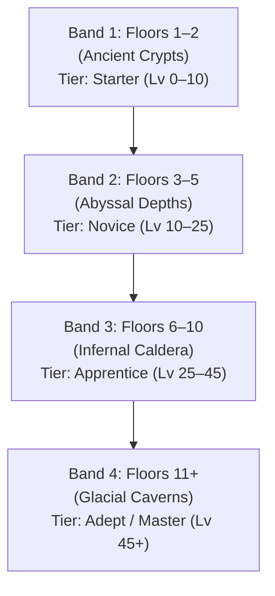

# Floor-Band Segmentation Brief

## Item 0: Starter Blockers & Audit Report

### 1. Hunting Bow & Spider Silk Source in Band 1
- **Status Confirmed**: In [`data/bowyerRecipes.json`](file:///c:/Users/insan/.gemini/antigravity/scratch/RPG%20True%20Gring%20-%20The%20Guild/data/bowyerRecipes.json#L3-L16), the **Hunting Bow** is a Level 0 recipe requiring **4 Wood** and **2 Spider Silk**.
- **The Blocker**: Spider Silk is primarily obtained from Spider corpses via **Skinning** ([`data/enemies.json:145`](file:///c:/Users/insan/.gemini/antigravity/scratch/RPG%20True%20Gring%20-%20The%20Guild/data/enemies.json#L145)). However, the ability to harvest animal/spider corpses is locked behind the **Skinning Research Node** ([`data/researchTree.json:43-48`](file:///c:/Users/insan/.gemini/antigravity/scratch/RPG%20True%20Gring%20-%20The%20Guild/data/researchTree.json#L43-L48)), which costs **10 Research Points (RP)**. Furthermore, in [`src/scenes/MainScene.ts:2449`](file:///c:/Users/insan/.gemini/antigravity/scratch/RPG%20True%20Gring%20-%20The%20Guild/src/scenes/MainScene.ts#L2449), defeated spiders do not even spawn a harvestable corpse unless Skinning is unlocked.
- **Where Silk Can Come From in Band 1**:
  1. *Primary Source (Research-gated)*: Giant Spiders spawn on Floor 1–2 in Band 1. Once the player spends 10 RP to unlock Skinning, each defeated Spider spawns a `corpse_skinning` node yielding 1 Spider Silk (+15 Skinning EXP).
  2. *Secondary Source (Curiosity)*: Locked Boxes obtained from Dig Spots ([`src/systems/LockpickingSystem.ts:77`](file:///c:/Users/insan/.gemini/antigravity/scratch/RPG%20True%20Gring%20-%20The%20Guild/src/systems/LockpickingSystem.ts#L77)) have a 30% chance to yield 2–5 Spider Silk when picked. However, this is doubly gated behind Digging research (10 RP) and Lockpick crafting (Steel Scrap).
  3. *Recommendation for Floor Band 1*: Retain Spiders in the Band 1 enemy pool so that as soon as the player unlocks Skinning (or Bowyer), silk is immediately farmable in the starter floors.

### 2. Greatsword Level Mismatch
- **Observation**: The Greatsword was referenced as "Lv 15", placing it well above the 0–10 starter band.
- **Code Audit**: In [`data/blacksmithRecipes.json:187-197`](file:///c:/Users/insan/.gemini/antigravity/scratch/RPG%20True%20Gring%20-%20The%20Guild/data/blacksmithRecipes.json#L187-L197), the recipe is defined as `requiredLevel: 0`, but has high resource costs (**8 Ore**, **3 Wood**) and top-tier base damage (`baseDamage: 12`, weight 9.0 in [`data/weapons.json:9`](file:///c:/Users/insan/.gemini/antigravity/scratch/RPG%20True%20Gring%20-%20The%20Guild/data/weapons.json#L9)).
- **Decision**: Documented as a recipe-level mismatch with the 0–10 starter band. Per instructions, **this will not be changed**.

### 3. Blacksmithing Modal Stockpile: Steel Scrap & Orc Heavy Hide Audit
- **Reported Issue**: The Blacksmithing modal displays stockpile counters for **Steel Scrap** and **Orc Heavy Hide**, but the previous report's 12-recipe table did not list recipes using them.
- **Code Audit**: In [`data/blacksmithRecipes.json`](file:///c:/Users/insan/.gemini/antigravity/scratch/RPG%20True%20Gring%20-%20The%20Guild/data/blacksmithRecipes.json), there are actually **17 recipes**, not 12. The previous report omitted 4 specialized recipes:
  1. `heavy_mace` (Lv 5): Requires 6 Ore, **3 Steel Scrap**, **1 Orc Heavy Hide**.
  2. `spiked_morningstar` (Lv 10): Requires 8 Ore, **5 Steel Scrap**, **2 Orc Heavy Hide**.
  3. `lockpick` (Lv 0): Requires **1 Steel Scrap**.
  4. `smelt_broken_lockbox` (Lv 0): Smelts 1 Broken Lockbox into **2 Steel Scrap**.
- **Conclusion**: The Blacksmithing modal is **not showing dead materials**. Steel Scrap and Orc Heavy Hide are actively used by Blacksmithing progression recipes. They belong to Elite/Mid-tier crafting, which connects naturally to Floor Band 2+.

---

## Proposed Floor-Band Segmentation Mapping

### Architecture Overview
Currently, [`data/dungeonConfig.json`](file:///c:/Users/insan/.gemini/antigravity/scratch/RPG%20True%20Gring%20-%20The%20Guild/data/dungeonConfig.json) defines a flat global `enemyPool` where any enemy (Wolf, Slime, Goblin, Goblin Archer, Skeleton, Skeleton Archer, Undead, Spider) can spawn on Floor 1.
We propose segmenting enemy spawns, elite/epic hazards, and gathering node weighting by **Floor Bands** aligned with the existing 4 dungeon regions and player progression tiers (0–10 Novice, 10–30 Apprentice, 30–60 Adept, 60+ Master).

---

### Detailed Band Specifications

#### Band 1: Ancient Crypts (Floors 1–2)
- **Target Proficiency Band**: Level 0–10 (Starter)
- **Enemy Pool**:
  - `wolf` (Common melee, beast pelt/meat corpse harvest)
  - `slime` (Common slow melee, slime gel)
  - `goblin` (Common fast melee, monster meat)
  - `spider` (Common poison melee, silk harvest)
- **Excluded**: Skeleton Archers, Goblin Archers (no ranged snipers on Floor 1), Undead (high HP tank), Elite Orc Warriors, Void Knights.
- **Node Distribution**:
  - Mining Rock Veins: High weight (~5 per floor for 1st weapon forge pacing)
  - Woodcutting Trees: Moderate weight (~2–3 per floor)
  - Foraging Bushes: Moderate weight (~2–3 per floor)
  - Water Pools: 0% in Band 1 (keeps initial floors dry, focused on core combat/gathering)
  - Dig Spots: 2–3 spots (if researched)

#### Band 2: Abyssal Depths (Floors 3–5)
- **Target Proficiency Band**: Level 10–25 (Novice)
- **Enemy Pool**:
  - `goblin` & `goblin_archer` (First ranged skirmishers)
  - `skeleton` & `skeleton_archer` (Ectoplasm drops for Alchemy revive/potions)
  - `undead` (Heavy HP frontline)
  - `spider` (Continued silk/poison supply)
- **Elite Spawns**: `orc_warrior` starts appearing (drops Steel Scrap and Orc Heavy Hide for Heavy Mace & Spiked Morningstar).
- **Boss Encounter**: Floor 5 Boss Chamber (`abyssal_colossus`).
- **Node Distribution**: Standard nodes + Water Pools & Fishing Spots enabled (water pools 2–5 tiles).

#### Band 3: Infernal Caldera (Floors 6–10)
- **Target Proficiency Band**: Level 25–45 (Apprentice)
- **Enemy Pool**:
  - `skeleton_archer`, `undead`, `orc_warrior` (Frequent elite spawns)
  - `void_knight` (Epic encounters start appearing, dropping Void Plate and Void Essence)
- **Boss Encounter**: Floor 10 Boss Chamber (`abyssal_colossus` enhanced).
- **Node Distribution**: Dense rock veins, rare dig spot curiosities.

#### Band 4: Glacial Caverns (Floors 11+)
- **Target Proficiency Band**: Level 45+ (Adept / Master)
- **Enemy Pool**: High-density mixed veterans, frequent `orc_warrior` and `void_knight`.
- **Boss Encounter**: Floor 15 Boss Chamber (`glacial_sovereign`).
- **Node Distribution**: Glacial water pools, ice-rimed nodes.

---

## Next Action
Waiting for user review and approval of this proposed mapping and item 0 findings before modifying configuration or code.
